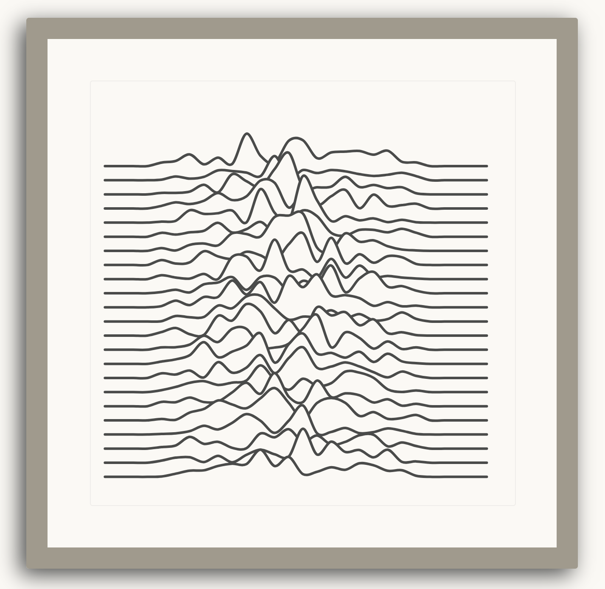

# Desert Waves~

My take on recreating Joy Division's
[Unknown Pleasures album cover](https://en.wikipedia.org/wiki/Unknown_Pleasures).
The waveforms start animating after first being rendered. Inspired by
following a tutorial on
[Generative Artistry](https://generativeartistry.com/tutorials/joy-division/).

The final result is evocative of desert sand.

Created with
[CodeSandbox](https://codesandbox.io/s/smoosh-feather-ts2zl?file=/README.md)
